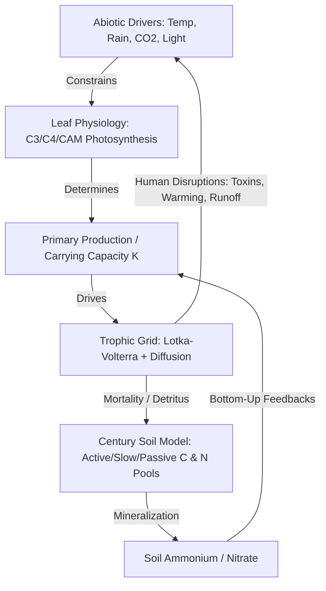

# EcoChain-AI: Cybernetic Ecology Simulator & Socratic LMS

EcoChain-AI is a dark, cybernetic, degree-level ecology simulator and Learning Management System (LMS). It is designed to teach complex systems thinking by coupling multi-species trophic network dynamics with biogeochemical cycling, leaf-level plant physiology, soil hydrology, and Socratic AI feedback.

---

## 🌌 System Overview & Scientific Framework

EcoChain-AI simulates ecosystems not merely as isolated population models, but as closed-loop biogeochemical systems where biotic interactions feed back directly into abiotic controls.



### 1. Spatial Trophic Grid Solver
* **Lotka-Volterra Dynamics with Diffusion**: Solves multi-species interactions on a $10 \times 10$ cellular grid.
* **Trophic Levels**: Supports Producers, Herbivores (primary consumers), Carnivores (secondary consumers), and Apex Predators.
* **Allee Effect (Depensation)**: Species suffer reduced growth rates and potential collapse when their local populations fall below an Allee threshold.
* **May's Complexity-Stability Limit**: Dynamically constructs and evaluates the system's **Jacobian matrix ($J$)** at equilibrium, calculating eigenvalues ($\lambda$) to evaluate Lyapunov stability:
  $$\text{Re}(\lambda_{\max}) < 0 \implies \text{Stable}$$

### 2. Leaf-Level Plant Physiology (C3, C4, CAM)
* **Photosynthesis Pathways**: Simulates photosynthetic pathways under varying temperature, solar radiation (PAR), CO2 concentration ($C_a$), and relative humidity (RH).
* **Water Use Efficiency (WUE)**: Models transpiration, water stress, and stomatal conductance ($g_s$). Plants adjust stomatal closure dynamically under high temperature or low relative humidity, balancing carbon assimilation ($A$) against water loss.

### 3. Century-Based Biogeochemical & Soil Carbon Cycling
* **Soil Organic Matter (SOM)**: Tracks carbon and nitrogen through three distinct soil pools:
  * **Active Pool** (rapid decomposition, microbial biomass)
  * **Slow Pool** (chemically protected organic matter)
  * **Passive Pool** (highly recalcitrant humus)
* **Nutrient Mineralization**: Simulates the transformation of organic nitrogen into inorganic **Ammonium ($NH_4^+$)** and **Nitrate ($NO_3^-$)**, which regulate the bottom-up carrying capacity ($K$) of primary producers.
* **Hydrology & Energy Exchange**: Solves daily evapotranspiration (ET), sensible heat, and latent heat fluxes based on leaf area and soil moisture dynamics.

### 4. Advanced Scientific Labs
* **Biodiversity-Stability Lab**: Batch-simulates species configurations to chart species richness against community yield and stability.
* **Lake Hysteresis Lab**: Models nutrient runoff (phosphorus loading) to demonstrate alternative stable states, bifurcations, and sudden regime shifts between clear-water macrophyte-dominated and turbid phytoplankton-dominated states.
* **Leslie Matrix Projections**: Projects age-structured populations over time, outputting the dominant eigenvalue ($\lambda_{\text{dominant}}$) for long-term growth, stable age distribution, and reproductive values.

---

## 🤖 Socratic AI Coach & Literature Corner

* **Socratic Lab Partner**: Powered by an LLM backend (integrates with Featherless API / fallback to local rules), the AI analyzes simulation runs to detect ecological anomalies:
  * **Trophic Cascade**: Top-down predator release or pressure changes.
  * **Competitive Exclusion**: Niche overlap leading to species extinction.
  * **Eutrophication**: Nutrient runoff causing algal blooms and hypoxic dead zones.
* **Socratic Feedback**: Rather than providing direct solutions, the Coach asks targeted questions referencing formal ecological vocabulary (e.g., carrying capacity, bottom-up regulation, trophic efficiency) to help students formulate hypotheses.
* **Literature Corner**: Integrated API to query the **OpenAlex** scientific database. Students search for real-world academic papers matching simulation behaviors and can dynamically inject empirical rates (like growth parameters) directly into their active sandbox.

---

## 🛠️ Tech Stack & Architecture

* **Frontend**: Next.js 16 (React 19), TypeScript, TailwindCSS, Recharts (visualizations), Framer Motion (cybernetic UI animations), Radix UI (accessible components).
* **Backend**: FastAPI (Python 3.12), NumPy, SciPy (differential solvers, eigenvalues), Pydantic v2 (type validation), OpenAI SDK.
* **Package Management**: `npm` (frontend) and `uv` (fast Python dependency manager).

---

## 🚀 Setup & Execution

### Prerequisites
Make sure you have Node.js (v18+) and Python 3.12 installed.

### 1. Installation

Install Node dependencies:
```bash
npm install
```

Set up the Python virtual environment and install dependencies using `uv`:
```bash
# Install uv if you don't have it
curl -LsSf https://astral.sh/uv/install.sh | sh

# Initialize virtual environment and install requirements
uv venv --python 3.12 api/.venv
uv pip install --python api/.venv/bin/python -r api/requirements.txt
```

### 2. Configuration
Copy the sample environment variables:
```bash
cp .env.example .env
```
Fill in the `.env` file with your credentials (e.g., `FEATHERLESS_API_KEY` for LLM analysis, otherwise the local rule-based fallback is used).

### 3. Running the Application

Start the **FastAPI Backend Server**:
```bash
npm run api:dev
```
*The API will run locally at `http://localhost:8000`.*

Start the **Next.js Frontend Server**:
```bash
npm run dev
```
*Open `http://localhost:3000` in your browser.*

---

## 🧪 Verification & Testing

Ensure code quality, type-safety, and test coverage before committing changes.

```bash
# Run Next.js linting and typechecking
npm run lint
npm run typecheck

# Run Next.js production build check
npm run build

# Run Backend Python test suite
npm run api:test
```

