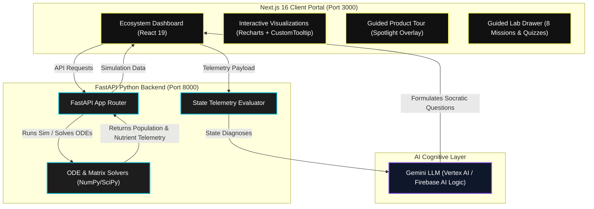

# EcoChain-AI: High-Fidelity Ecosystem Simulator & Socratic LMS

EcoChain-AI is a high-fidelity interactive sandbox and Socratic learning management system designed to make complex, non-linear ecological systems intuitive. By combining numerical mathematical solvers (Lotka-Volterra ODEs, Farquhar canopy exchange, Century soil models, and Leslie demography matrixes) with a real-time Socratic AI Coach, EcoChain-AI transforms textbook formulas into an immersive, active learning experience.

---

## 🏛️ System Architecture

---

## ⚡ Key Features

*   **Trophic Dynamics Sandbox**: Runs a 30-year Lotka-Volterra ODE population simulation across a 10x10 spatial grid. Supports local stability analysis (Jacobian matrix eigenvalues plotted on the complex plane) and localized disturbances (wildfires, logging, grazing).
*   **Canopy Physiology & Hydrology**: Simulates leaf-level gas exchange ($A_{net}$ photosynthesis & $g_s$ conductance) using the biochemical Farquhar-von Caemmerer-Berry model, paired with a bucket hydrology model for soil moisture and sensible/latent heat fluxes ($H$ and $LE$).
*   **Soil Biogeochemistry**: Models Century-style kinetic decomposition cycling Carbon through active, slow, and passive pools, and Inorganic Nitrogen stocks (Ammonium & Nitrate) based on stoichiometric constraints.
*   **Leslie Demography & Lake Hysteresis**: Models age-structured population growth rates ($\lambda$ convergence) and profiles alternative stable states using the forward/backward phosphorus loading tipping loops.
*   **Socratic AI Coach**: Evaluates live telemetry data to diagnose ecological state anomalies (e.g. trophic cascades) and prompts students with targeted questions to guide active learning.
*   **Guided Lab Missions**: 8 interactive science labs covering the Insurance Hypothesis, biogeochemical constraints, and human harvesting.

---

## 🌐 Live Deployments
*   **Interactive Web App**: [https://ecochain-frontend.onrender.com](https://ecochain-frontend.onrender.com)
*   **FastAPI Telemetry API**: [https://ecochain-api.onrender.com](https://ecochain-api.onrender.com)
