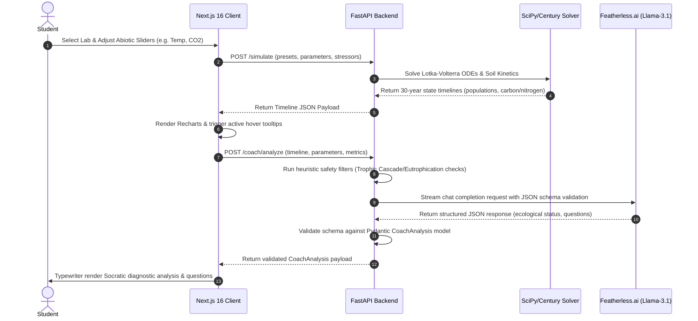

# EcoChain-AI: High-Fidelity Ecosystem Simulator & Socratic LMS

EcoChain-AI is a high-fidelity interactive sandbox and Socratic learning management system designed to make complex, non-linear ecological systems intuitive. By combining numerical mathematical solvers (Lotka-Volterra ODEs, Farquhar canopy exchange, Century soil models, and Leslie demography matrixes) with a real-time Socratic AI Coach hosted on **Featherless.ai**, EcoChain-AI transforms static textbook formulas into an immersive, active learning experience.

---

## 🏛️ System Architecture

### 1. Data Flow Architecture
```mermaid
flowchart TD
    classDef client fill:#111111,stroke:#faff69,stroke-width:2px,color:#ffffff;
    classDef server fill:#1d1d1d,stroke:#06b6d4,stroke-width:2px,color:#ffffff;
    classDef ai fill:#0f172a,stroke:#8b5cf6,stroke-width:2px,color:#ffffff;

    subgraph Client ["Next.js 16 Web Interface (React 19)"]
        UI["1. Dashboard Portal"]:::client
        Charts["2. Recharts Visualize (CustomTooltip)"]:::client
        LMS["3. LMS Lab Drawer (8 Missions & Quizzes)"]:::client
    end

    subgraph Backend ["Python FastAPI Server"]
        API["4. FastAPI Router"]:::server
        Solvers["5. SciPy ODE Solvers (Lotka-Volterra)"]:::server
        Century["6. Century Carbon/Nitrogen Kinetics"]:::server
        Heuristics["7. Local Anomaly Heuristics"]:::server
    end

    subgraph Inference ["Featherless.ai Serverless LLM"]
        LLM["8. Llama-3.1-8B-Instruct"]:::ai
    end

    UI -->|Adjust Biomes/Abiotic Sliders| API
    LMS -->|Select Lab Challenge| UI
    
    API -->|Solve differential equations| Solvers
    Solvers -->|Compute decomposition & nutrient cycles| Century
    Century -->|State timeline results| API
    API -->|Simulation JSON Trajectory| UI
    UI -->|Render population curves| Charts

    Charts -->|Telemetry payload: populations, rates, metrics| API
    API -->|Pre-evaluates thresholds| Heuristics
    API -->|POST JSON Request (OpenAI SDK)| LLM
    LLM -->|Generate Socratic Coaching Questions & Diagnoses| API
    API -->|Return validated CoachAnalysis Pydantic object| UI
    UI -->|Typewriter render cognitive feedback| UI
```

### 2. Telemetry-Driven Socratic Loop Lifecycle


---

## 🧮 Mathematical Foundations

EcoChain-AI solves four core biological models numerically to drive real-time dashboard telemetry and charts:

### 1. Trophic Dynamics (Lotka-Volterra ODEs)
For an arbitrary number of interacting species $S$, the population change for species $i$ is solved using a system of coupled ordinary differential equations:
$$\frac{dN_i}{dt} = r_i N_i \left(1 - \frac{N_i}{K_i}\right) + N_i \sum_{j=1}^{S} \alpha_{ij} N_j$$
where:
*   $N_i$ is the population density of species $i$.
*   $r_i$ is the intrinsic growth rate.
*   $K_i$ is the carrying capacity, determined dynamically by soil nitrogen stoichiometry.
*   $\alpha_{ij}$ is the interaction coefficient (positive for mutualism, negative for competition/predation).

### 2. Canopy Physiology (Farquhar-von Caemmerer-Berry model)
Leaf-level gas exchange and net photosynthesis ($A_{net}$) are simulated based on the biochemical constraints of C3 plants:
$$A_{net} = \min(A_c, A_j) - R_d$$
where:
*   $A_c$ is the Rubisco-limited carboxylation rate:
    $$A_c = \frac{V_{cmax} (C_c - \Gamma^*)}{C_c + K_c (1 + O / K_o)}$$
*   $A_j$ is the electron transport-limited carboxylation rate:
    $$A_j = \frac{J (C_c - \Gamma^*)}{4.5 C_c + 10.5 \Gamma^*}$$
*   $R_d$ is mitochondrial respiration, $C_c$ is chloroplastic $CO_2$ concentration, and $\Gamma^*$ is the $CO_2$ compensation point.

### 3. Age-Structured Demography (Leslie Matrix)
Population projection over discrete time intervals is computed via matrix multiplication:
$$\mathbf{n}_{t+1} = \mathbf{L} \mathbf{n}_t$$
where $\mathbf{L}$ is the Leslie Matrix containing age-class fecundities ($f_i$) and survival probabilities ($s_i$):
$$\mathbf{L} = \begin{bmatrix}
f_0 & f_1 & f_2 & \dots & f_{k-1} & f_k \\
s_0 & 0 & 0 & \dots & 0 & 0 \\
0 & s_1 & 0 & \dots & 0 & 0 \\
\vdots & \vdots & \vdots & \ddots & \vdots & \vdots \\
0 & 0 & 0 & \dots & s_{k-1} & 0
\end{bmatrix}$$
The dominant eigenvalue $\lambda$ of $\mathbf{L}$ determines the long-run asymptotic population growth rate.

### 4. Soil Biogeochemistry & Stoichiometry (Century model kinetics)
Carbon decomposition flows through active (labile), slow (cellular), and passive (humified) soil organic matter pools:
$$\frac{dC_i}{dt} = I_i - k_i M_T M_W C_i$$
where:
*   $k_i$ is the pool-specific decay rate.
*   $M_T$ and $M_W$ are temperature and moisture scaling factors.
Stoichiometric limitations govern nitrogen mineralization, utilizing Liebig's Law of the Minimum to constrain primary productivity:
$$g_{lim} = \min\left(\frac{\text{Carbon}}{\text{Carbon}_{\text{target}}}, \frac{\text{Nitrogen}}{\text{Nitrogen}_{\text{target}}}, \frac{\text{Phosphorus}}{\text{Phosphorus}_{\text{target}}}\right)$$

---

## 🧠 Socratic AI Coach & Featherless.ai Integration

The Socratic AI Coach reads live telemetry state vectors and uses **cognitive scaffolding** to guide the student toward forming hypotheses, rather than revealing answers directly.

### 🔌 Featherless.ai Integration
To run model inference with low-latency and cost-effective hosting, we integrated **Featherless.ai** as the serverless LLM provider, hosting `meta-llama/Meta-Llama-3.1-8B-Instruct`. The Python FastAPI backend uses the OpenAI-compatible SDK to stream JSON-validated outputs.

### 📡 Telemetry JSON Payload Structure
Whenever a simulation completes, the frontend submits the state trajectories to the API, which compiles a summary payload containing abiotic factors, numerical solver parameters, and peak-to-trough ratios:

```json
{
  "preset_id": "trophic-cascade",
  "abiotic_factors": {
    "rainfall": 250.0,
    "temperature": 34.0,
    "nitrogen": 20.0,
    "co2": 420.0,
    "relative_humidity": 65.0,
    "light_intensity": 800.0
  },
  "differential_equation_parameters": {
    "r": 0.18,
    "K": 140.0,
    "alpha": 0.0019
  },
  "ecosystem_summary_metrics": {
    "peaks": {
      "plants": {"year": 4, "value": 138.2},
      "rabbits": {"year": 6, "value": 85.0},
      "wolves": {"year": 8, "value": 12.0}
    },
    "troughs": {
      "plants": {"year": 12, "value": 14.5},
      "rabbits": {"year": 14, "value": 0.0},
      "wolves": {"year": 18, "value": 0.0}
    },
    "net_change_percent": {
      "plants": -85.2,
      "rabbits": -100.0,
      "wolves": -100.0
    },
    "predator_to_prey_ratio": {
      "min": 0.0,
      "max": 0.141,
      "final": 0.0
    }
  }
}
```

The **Featherless.ai** LLM parses this payload and responds with a strictly structured JSON schema matching Pydantic validator requirements:

```json
{
  "ecological_status": "Collapse",
  "detected_anomalies": [
    {
      "name": "Trophic Cascade",
      "year_of_onset": 8,
      "description": "High top-down control by secondary consumers causes a rapid collapse of primary consumers at Year 8, releasing primary producers from herbivory before the entire trophic web collapses due to resource exhaustion."
    }
  ],
  "socratic_questions": [
    "How does the ratio of apex predators to herbivores at Year 5 impact the bottom-up stability of the primary producers?",
    "Given that the abiotic factors constrained the carrying capacity, how did this alter the resilience of the ecosystem to high predator pressure?"
  ]
}
```

---

## 🎓 The 8 Curriculum Labs

Students apply scientific methodologies by running virtual lab experiments in the sandbox, checking off hypotheses, and taking quiz assessments:

| Lab ID | Lab Mission Name | Core Scientific Focus | Target Hypothesis |
| :--- | :--- | :--- | :--- |
| **`may-stability`** | May's Complexity-Stability | Complexity vs. stability relationship | Increasing interaction links ($\alpha_{ij}$) and species count reduces local equilibrium stability. |
| **`competitive`** | Competitive Exclusion | Resource competition & niche space | Two species competing for the exact same limiting resource cannot stably coexist (Gause's Law). |
| **`rescue`** | Trophic Cascade Rescue | Top-down control & keystone species | Reintroducing apex predators suppresses herbivores, rescuing vegetation from overgrazing collapses. |
| **`eutrophication`** | Anthropogenic Eutrophication | Carrying capacity & density limits | Excess nitrogen loading inflates carrying capacity temporarily but triggers severe boom-and-bust crashes. |
| **`climate-toxins`** | Climate Warming & Toxins | Stressors & Biomagnification | Climate stress destabilizes population oscillations and accelerates heavy metal toxin bioaccumulation. |
| **`physiology-wue`** | Canopy Physiology & WUE | Leaf gas exchange & conductance | High ambient $CO_2$ allows plants to close stomata and increase Water-Use Efficiency (WUE). |
| **`lake-hysteresis`** | Alternative Stable States | Phosphorus loading & tipping points | Lake recovery requires reducing phosphorus loading far below the tipping point that caused collapse. |
| **`som-kinetics`** | Soil Organic Matter Kinetics | Carbon decomposition & Century model | Temperature and moisture increases accelerate decomposition rates, reducing passive organic stocks. |

---

## 🌐 Live Deployments
*   **Interactive Web App**: [https://ecochain-frontend.onrender.com](https://ecochain-frontend.onrender.com)
*   **FastAPI Telemetry API**: [https://ecochain-api.onrender.com](https://ecochain-api.onrender.com)
