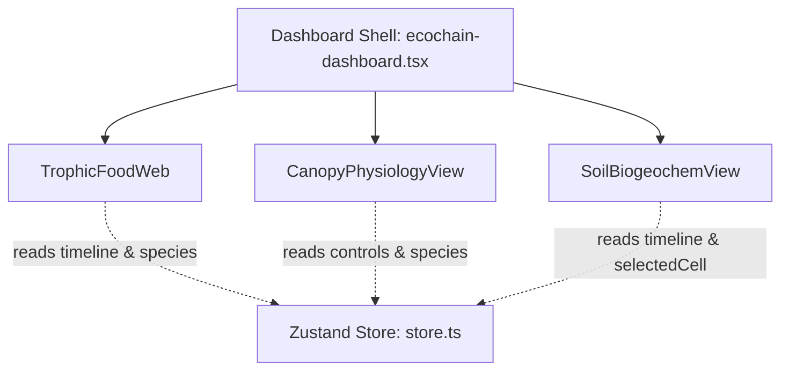

# EcosystemAI — Technical Walkthrough & Architecture Guide

This document describes the architectural changes, data structures, and mathematical formulations implemented to provide high-fidelity representations of **Trophic Dynamics**, **Canopy Physiology**, and **Soil & Biogeochemistry** in the EcosystemAI platform.

---

## 1. Modular Architecture Overview

To maintain codebase sanity and abide by the 500-lines-per-file guideline, the monolithic dashboard has been refactored. The main interface shell at [`ecochain-dashboard.tsx`](file:///home/deu/Coding%20Repos/EcosystemAI/src/features/simulator/components/ecochain-dashboard.tsx) now delegates tabs to specialized view components that utilize the global Zustand store [`store.ts`](file:///home/deu/Coding%20Repos/EcosystemAI/src/features/simulator/store.ts) for state synchronization:

### Files Created & Modified:
1. **[NEW]** [`trophic-food-web.tsx`](file:///home/deu/Coding%20Repos/EcosystemAI/src/features/simulator/components/trophic-food-web.tsx): Renders the interactive species food web SVG network and the Trophic Biomass Pyramid.
2. **[NEW]** [`canopy-physiology-view.tsx`](file:///home/deu/Coding%20Repos/EcosystemAI/src/features/simulator/components/canopy-physiology-view.tsx): Handles stomatal pore dilation, leaf pathway diagrams, and Farquhar-limited photosynthesis curves.
3. **[NEW]** [`soil-biogeochem-view.tsx`](file:///home/deu/Coding%20Repos/EcosystemAI/src/features/simulator/components/soil-biogeochem-view.tsx): Contains nutrient maps, timelines, and the Century SOM box-model flowchart.
4. **[MODIFY]** [`ecochain-dashboard.tsx`](file:///home/deu/Coding%20Repos/EcosystemAI/src/features/simulator/components/ecochain-dashboard.tsx): Gutted local state, added imports, integrated new tabs, and updated layout columns to 5.
5. **[MODIFY]** [`ai-coach-panel.tsx`](file:///home/deu/Coding%20Repos/EcosystemAI/src/features/simulator/components/ai-coach-panel.tsx): Restyled borders and accents to ClickHouse electric yellow.

---

## 2. Technical Features & Physics Formulations

### A. Canopy Physiology & Water-Use Efficiency
Photosynthesis and stomatal conductance are calculated dynamically on the client side using the **Farquhar-von Caemmerer-Berry (FvCB)** model:

1. **Rubisco-limited Assimilation ($A_c$)**:
   $$Ac = V_{cmax} \frac{C_a - \Gamma^*}{C_a + 736.0}$$
   Where $C_a$ is atmospheric CO₂ concentration and $\Gamma^*$ is the CO₂ compensation point ($40.0 + 1.8 \times (\text{Temp} - 20.0)$).
   
2. **Light-limited Assimilation ($A_j$)**:
   $$Aj = \frac{J}{4} \frac{C_a - \Gamma^*}{C_a + 2\Gamma^*}$$
   Where electron transport rate $J = J_{max} \frac{I}{I + 500.0}$ is a function of light intensity ($I$, PAR).
   
3. **Ball-Berry Stomatal Conductance ($g_s$)**:
   $$g_s = g_0 + a_{slope} \frac{A_{net} \cdot h_s}{C_a} \cdot f_{water}$$
   Where $h_s$ is relative humidity, $f_{water}$ is soil moisture stress multiplier, and $g_0 = 0.02$ mol/m²/s is minimum conductance.

#### Interactive Stoma SVG:
The guard cells are rendered as dynamic overlapping ellipses. As stomatal conductance ($g_s$) increases, the guard cells swell and separate:
- **Left Cell Center**: $cx = 85 - 15 \cdot g_s$
- **Right Cell Center**: $cx = 115 + 15 \cdot g_s$
- **Pore Width**: $\text{width} = g_s \cdot 36$
- Escalating water vapor particles ($\text{H}_2\text{O}$) and entering carbon dioxide ($\text{CO}_2$) animate along paths when the stoma is open.

---

### B. Soil Biogeochemistry & Century decomposition
The system simulates soil organic carbon decomposition and nitrogen cycling in the grid cells:

1. **Carbon pool decay rate ($k$)**:
   $$k = k_0 \cdot e^{0.07 \cdot (\text{Temp} - 20.0)} \cdot \frac{\text{Soil Moisture}}{0.30}$$
   Where $k_0$ is $0.05$ (Active), $0.005$ (Slow), and $0.0002$ (Passive).
   
2. **Decay flow arrow animation**:
   Flow arrows are styled with animated SVG dash arrays. The animation speed is calculated as a function of the active decay rates:
   $$\text{Duration} = \max\left(1.0, \frac{4.0}{k_{decay} + 0.01}\right) \text{ seconds}$$
   Increasing soil moisture and temperature speeds up the particles flowing through the diagram boxes.
   
3. **Liebig's Law Limitation**:
   Stoichiometric demands are set at $40:1$ for C:N and $400:1$ for C:P.
   $$\text{Nitrogen Index} = \frac{N_{available}}{\text{Carbon} / 40.0}$$
   $$\text{Phosphorus Index} = \frac{P_{available}}{\text{Carbon} / 400.0}$$
   The growth limitation index is defined as $\min(\text{N Index}, \text{P Index}, 1.0)$. Any value below 1.0 triggers an active limitation alert.

---

## 3. UI Rework & Layout Improvements

1. **Balanced 3-Pane Desktop Layout**:
   Changed the container grid from a 4-column layout to a 5-column layout:
   - **Column 1**: Biome configurations and species sliders (`lg:col-span-1`).
   - **Columns 2-4**: Central Dashboard Workstation for tabs (`lg:col-span-3`).
   - **Column 5**: AI Coach panel (`lg:col-span-1`).
   This allows all panels to sit side-by-side on desktop displays without clipping, providing a streamlined workspace.

2. **Clean Design Alignment**:
   - Swapped out default Tailwind HSL properties.
   - Refactored borders to a consistent `border-hairline` (#2a2a2a).
   - Replaced cyan accents and borders in the AI Coach Panel with ClickHouse electric yellow (`text-primary` and `border-primary/20`).

---

## 4. Verification & Validation

The build has been verified locally and compiles successfully:
- **TypeScript compilation**: `npx tsc --noEmit` returns zero errors.
- **Production Build**: `npm run build` compiles successfully under Next.js 16 (Turbopack) and packages static routes cleanly.
- **Git State**: Cleaned, committed, and pushed to the GitHub repository.
